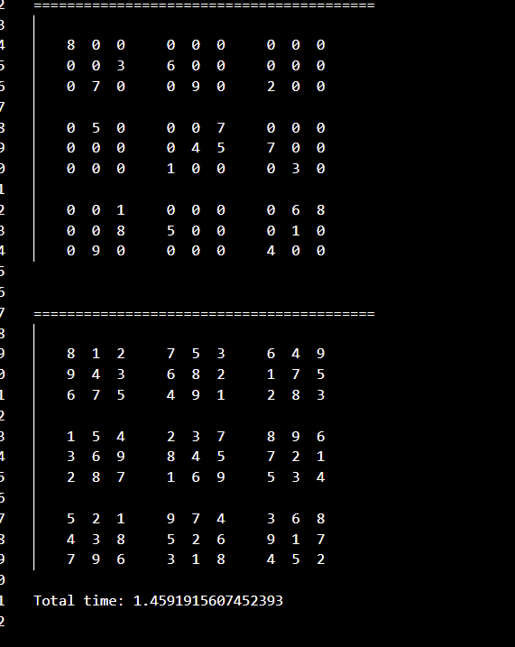
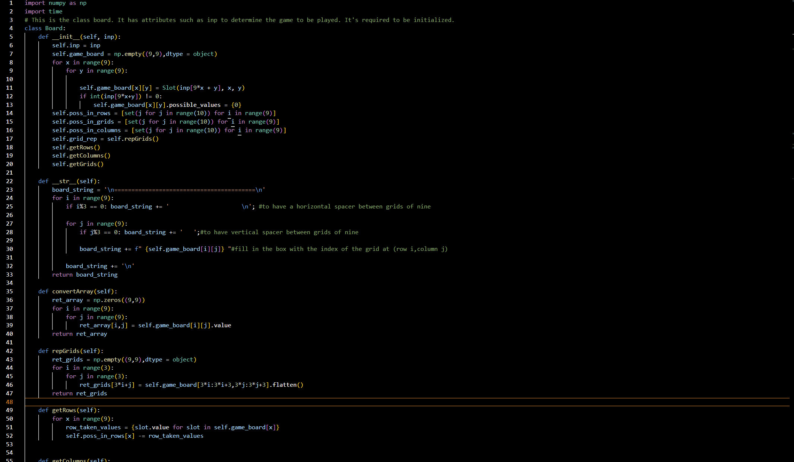
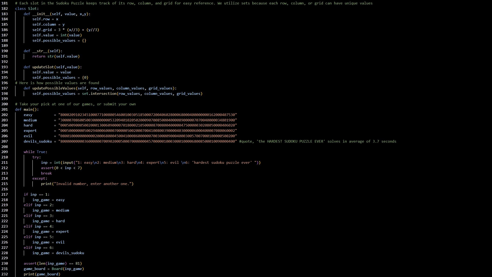
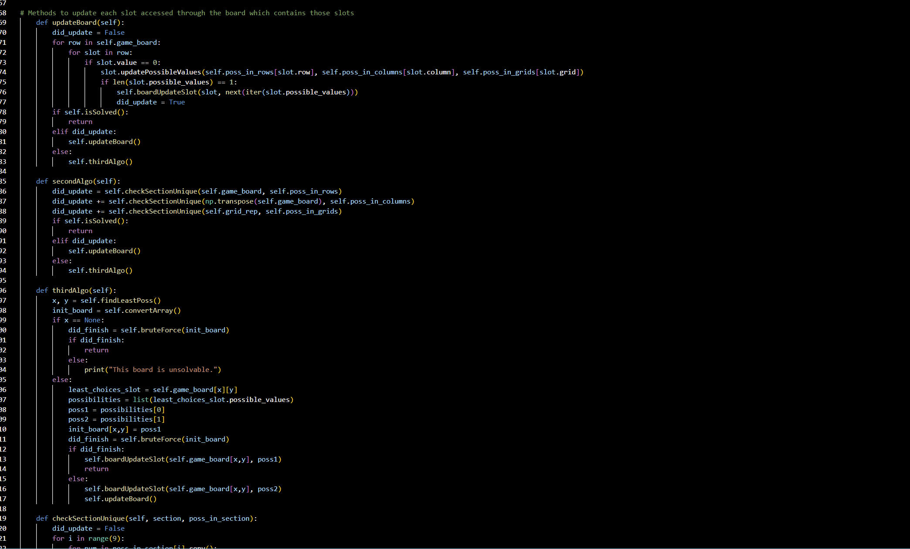

# SudokuTorture
Create a python based algorithm to solve Sodoku problems using Object-Oriented-Programming.

##  Object Oriented Approach
Version 1.0  

Add the link to the file below:


## Licenses
[](https://opensource.org/licenses/MIT)


## Table of Contents:
1. [Description](#description)
2. [Installation](#installation)
3. [User Story](#user-story)
4. [Contributors](#contributors)
5. [Technologies Used](#technologies-used)
6. [Future Development](#future-development)
## Description
We were curious about what an class-based Sudoku solver software would look like. Furthermore, in order to faccilitate collaboration, classes standardized the way we access, reference, and use data throughout our program.

Here's a look at how we initialize our Board Class. It contains attributes such as lists each containing 9 sets - indexed by their respective row, grid, or column - We use sets because we know that we want unique values for each column and row, and that allows us to set intersections between the possible values for each slot in a given row, grid and column. This will in turn, return the possible values each "free" or unassigned slot can take in a given row. Take a look at how the final method shown, getRows(self), subtracts the taken value of each row from the set of possible values which when instantiated, was a set of values in the range of 1 thru 9.



Here's a look at the class slot and it's attributes. In our algorithms, we directly access each slot's x, y, or grid attribute (self.row, self.column, self.grid respectively) to make the game as efficient as possible. Furthermore, when the slot value is updated, the possible_values set now contains {0} - our program ommits these Slots because their value is no longer 0, but a value derived from the set if the length of it's possible_values attribute is 1. There's an updateBoard() method in the Class Board that calls for this method for the respective slot in the algorithm is uses. 




Here, you can take a look at two of the algorithms we designed. Please, contact us for further explanation, or take the time to understand the simplicity behind the madness (the nested levels of abstraction). However, you can see that the updateBoard() algorithm is checking if there is a clear move, or the length of possible values for a slot is one, and the board then updates itself with that value by directly accessing the slot's row, column, and grid properties.



## Installation
Clone down the repo:
```
git clone git@github.com:AlexisGonzalez07/SudokuTorture.git
```
Install dependencies:
```
$ pip install numpy, time
```
Run the file with the editor of your choice and solve any puzzle in seconds:
```

## User Story

```md
AS a user with a healthy healthy obsession with sudoku puzzles,
I want a software program that will solve even the hardest Sudoku puzzles
SO that I can flex my genius to my peers
```

# Contributors:

| Person      |  |      |
| :---        |    :----:   |          ---: |
| Alexis Gonzalez      | https://www.linkedin.com/in/alexis-gonzalez-07       |  https://github.com/AlexisGonzalez07   |
| Devon Gulley   | https://www.linkedin.com/in/devon-gulley/        |https://github.com/devongulley1602    |
| James D'Imperio     | https://www.linkedin.com/in/james-dimperio/       | https://github.com/jgd78   |
| Talon Logan   | https://www.linkedin.com/in/talon-logan-b3bba4231/        | https://github.com/aologan      |
| Victor Lupasco    | https://www.linkedin.com/in/victor-lupascu-823650209/       | https://github.com/vitokwolf   |


## Technologies Used
<br>

 


## Future Development
-Any ideas?